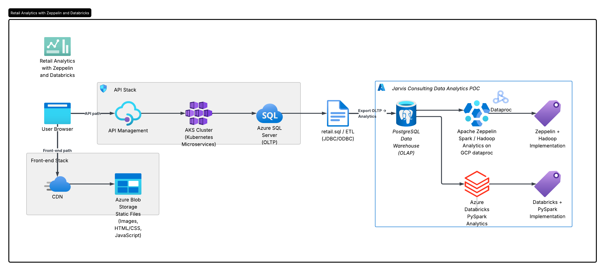

# Retail Data Analytics Using Zeppelin and Databricks

## Introduction

Retail organisations generate large volumes of transactional data through their e-commerce platforms. However, extracting meaningful business insights from this data requires a scalable analytics infrastructure capable of processing large datasets efficiently.

This project demonstrates how distributed Spark environments can be used to analyse retail transaction data and generate business insights using two big-data analytics platforms:

Apache Zeppelin running on Hadoop (GCP Dataproc)
Databricks using PySpark (cloud Spark environment)

The goal of this project is to design a scalable analytics workflow that supports KPI generation, customer behaviour analysis, and segmentation using Spark-based processing pipelines.

The dataset contains retail transaction records, including:

* Invoice Number
* Product Description
* Quantity
* Invoice Date
* Unit Price
* Customer ID
* Country

Using this dataset, several business analytics workflows were implemented, including:

* Monthly sales trend analysis
* Customer activity tracking
* Cancelled vs completed order comparison
* Country-level revenue insights
* Customer segmentation using the RFM model

Technologies used:

* PostgreSQL (transactional dataset source)
* Hadoop Distributed File System (HDFS)
* GCP dataproc
* Apache Zeppelin
* Databricks
* PySpark DataFrame API
* Spark SQL
* Hive Metastore
* JDBC ingestion
* Git & GitHub

### This project was implemented using two different analytics platforms:

1. Apache Zeppelin on Hadoop (GCP Dataproc)
2. Databricks using PySpark DataFrame API

###  Architecture

  

### Databricks and Hadoop Implementation
Dataset and Analytics Work

This project uses the Online Retail transactional dataset, which contains historical purchase records generated by an e-commerce retail platform. Retail transaction data was ingested into the Databricks environment from PostgreSQL using a JDBC connection. The dataset was then processed using PySpark DataFrame APIs and Spark SQL to perform distributed analytics at scale.
The following analytics workflows were implemented:

* JDBC ingestion from PostgreSQL into Databricks
* Data cleaning and preprocessing
* Handling cancelled transactions
* Revenue feature engineering (Revenue = Quantity × Unit Price)
* Monthly sales trend analysis
* Month-over-month growth calculation
* Monthly active customers tracking
* New vs returning customer analysis
* Cancelled vs completed orders comparison
* Invoice value distribution analysis
* Customer segmentation using the RFM model

Notenook [Retail Data Analytics with PySpark Notebook](./notebook/Retail%20Data%20Analytics%20with%20PySpark.ipynb)

### Zeppelin and Hadoop Implementation
Dataset and Analytics Work

The same Online Retail transactional dataset was analyzed in the Apache Zeppelin environment running on a Hadoop cluster (GCP Dataproc) to demonstrate how distributed Spark analytics workflows can be implemented across different big-data platforms.

Retail transaction data was ingested into the Zeppelin environment using both CSV ingestion into HDFS and JDBC ingestion from PostgreSQL, enabling scalable distributed processing using Spark on Hadoop.

Notebook:  [Retail Data Analytics Zeppelin Notebook](./notebook/Spark%20Dataframe%20-%20WDI%20Data%20Analytics.zpln)

### Future Improvement

Although this project successfully implements a distributed batch analytics workflow using Spark across Databricks and Zeppelin environments, several improvements can enhance scalability, reliability, and production readiness.

* Delta Lake Integration for Reliable Storage
* Real-Time Streaming Analytics Pipeline
* Machine Learning-Based Customer Segmentation
* Data Visualization Dashboard Integration
* Workflow Automation Using Orchestration Tools

## Databricks ETL
 
### Introduction
This project implements a scalable fraud analytics data pipeline using Apache Spark and Databricks following the Medallion Architecture (Bronze ? Silver ? Gold).

The objective of this project is to design and build a structured ELT pipeline capable of ingesting transactional financial data, enriching it with merchant category and fraud labels, transforming it into analytics-ready datasets, and powering an interactive fraud analytics dashboard.

The pipeline demonstrates how modern data engineering workflows enable organizations to detect fraud patterns, monitor suspicious activity trends, and support data-driven security decisions.

### Technologies used in this project:
* Apache Spark (PySpark)
* Azure Databricks
* Unity Catalog
* Azure SQL Database (JDBC ingestion)
* Delta Tables
* Medallion Architecture (Bronze ? Silver ? Gold)
* Databricks Workflows (pipeline orchestration)
* Databricks SQL Dashboard

### Dataset used
* transactions_data
* cards_data
* users_data
* mcc_codes.json
* train_fraud_labels.json

### Analytics performed
* Fraud rate trend analysis
* Fraud distribution by weekday
* Fraud distribution by time-of-day
* Merchant fraud risk profiling
* User-level fraud activity tracking
* Weekly fraud participation metrics
* Fraud vs non-fraud transaction comparison
* Daily fraud loss monitoring
* High-value transaction fraud detection
* Behavioral change before vs after fraud events

### Pipeline Orchestration
* Bronze Notebook
* Silver Notebook
* Gold Notebook
* Dashboard Refresh

## Databricks (DLT) Pipeline - Stock Market Analytics

### Introduction 
This project also includes a Delta Live Tables (DLT) pipeline that implements a scalable medallion architecture to ingest and transform stock market data from the Alpha Vantage API using Databricks.

The goal of this pipeline is to demonstrate modern streaming-style ingestion and automated data quality enforcement using DLT while producing analytics-ready datasets for stock performance monitoring and trend analysis.

### Data Source
Stock market data is collected from the Alpha Vantage API.

* Latest stock prices
* Historical price movements
* Trading volume
* Company metadata

### Architecture Overview
Data Flow:

1.Alpha Vantage API        
2.Bronze Layer (raw API ingestion)
3.Silver Layer (cleaned + standardized schema)
4.Gold Layer (aggregated analytics tables)        
5.Dashboard / Analytics queries

### Key features
* Uses Auto Loader?style ingestion logic inside DLT
* Handles schema evolution automatically
* Maintains ingestion timestamps

### Aggregations performed
* 7-day price trend
* 30-day moving averages
* 90-day trend indicators
* Percentage price change
* Trading volume trend analysis

### Data Quality Enforcement (DLT Expectations)
* Automatic validation
* Pipeline monitoring visibility
* Failure handling with alerts
* Improved trust in analytics outputs

### Orchestration
* Bronze ingestion
* Silver transformation
* Gold aggregation
* Dashboard refresh

##  Future Improvements
* Implement Structured Streaming ingestion to convert both ELT and DLT pipelines from batch processing to real-time analytics pipelines 
* Introduce Delta Live Tables expectations for the ELT fraud pipeline to enforce automated data quality validation and monitoring
* Optimize performance using partitioning strategies (e.g., transaction_date, symbol) and Z-order indexing for faster query execution 
* Add anomaly detection models to automatically identify suspicious fraud behaviour and abnormal stock price movement using machine learning
* Integrate external BI tools such as Power BI or Tableau for enterprise-grade dashboard reporting
* Enable CI/CD automation using GitHub Actions and Databricks Repos for pipeline deployment and version-controlled workflow execution
* Extend the stock DLT pipeline to include advanced technical indicators such as RSI, MACD, and moving average crossover signals
* Add additional financial data sources (e.g., Yahoo Finance, Polygon API) to enrich stock analytics coverage
* Implement role-based access control using Unity Catalog governance policies for production-ready data security 
*Deploy workflow scheduling with parameterized jobs for automated daily pipeline execution across both ELT and DLT architectures

